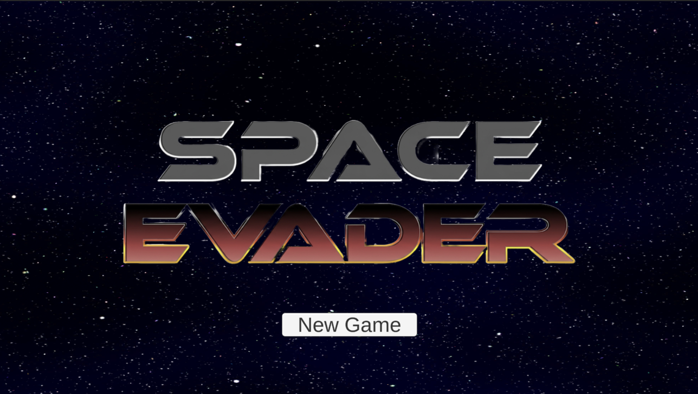

# Space Evader

A 2D space shooter built in Unity. Fight through waves of enemies, collect power-ups, and take down the final boss to survive.

---

## Gameplay

- **Move** — `W A S D`
- **Shoot** — `Left Click`

When you start a new game, a how-to-play screen will appear. The first enemy wave won't begin until you move or shoot.

---

## Features

- Multiple enemy waves with increasing difficulty
- Boss fight with a destructible shield
- Three power-ups:
  - **Blue** — temporary shield
  - **Red** — rapid fire
  - **Green** — +5 lives
- Lives system with game over and win screens
- Scrolling space background

---

## Scenes

| Scene | Description |
|---|---|
| `Menu` | Main menu with New Game button |
| `GameScene` | Main gameplay |
| `GameOver` | Shown when all lives are lost |
| `YouWin` | Shown after defeating the boss |

---

## Screenshots

### Menu

### Gameplay

### Boss Fight

### Game Over & Win

---

## Built With

- [Unity](https://unity.com/)
- C#
- TextMesh Pro
